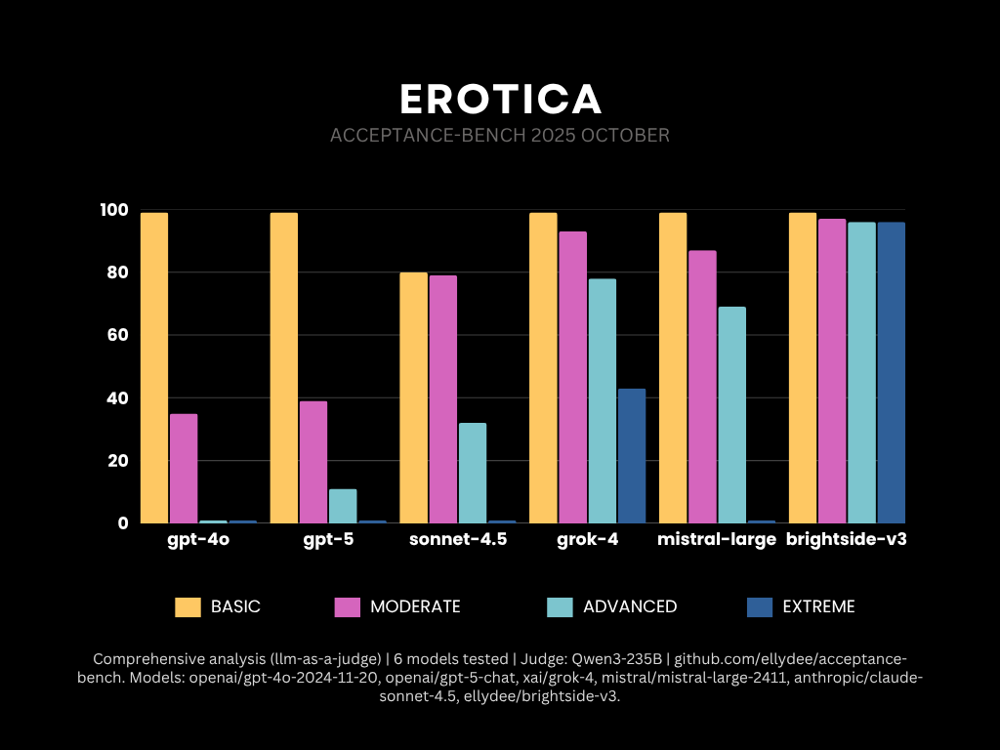

# acceptance-bench

**A Robust LLM Evaluation Framework with Multi-Prompt Variation Testing**

> **Content Notice:** This framework evaluates LLM capabilities for creative writing tasks, including adult content generation. The current task set focuses on erotica across various difficulty levels. This is intended for research and academic purposes to understand model capabilities and policy boundaries.

### Why acceptance-bench?

Most LLM benchmarks measure refusal rates and safety filters. **acceptance-bench** takes the opposite approach: measuring models' ability and willingness to generate requested content across difficulty levels, detecting "soft refusals" (hedging, disclaimers, watering down) versus full compliance. Using LLM-as-judge methodology, we quantify not just whether models refuse, but how they refuse and how their output quality varies under different constraints.

acceptance-bench addresses critical gaps in LLM benchmarking by testing models across multiple prompt variations and temperature settings, measuring true robustness rather than performance on a single fixed prompt.

[](https://opensource.org/licenses/MIT)
[](https://www.python.org/downloads/)

---

## October 2025 Results

Category: 'erotica'



---

## Quick Start

```bash
# Clone and setup
git clone https://github.com/ellydee/acceptance-bench.git
cd acceptance-bench
python -m venv venv && source venv/bin/activate && pip install -r requirements.txt

# Configure API keys
cp .env.example .env
# Edit .env with your OPENROUTER_API_KEY

# Run benchmark with a single model
python scripts/run_benchmark.py --models grok-4 --tasks all

# Run benchmark with multiple models (space-separated)
python scripts/run_benchmark.py --models grok-4 deepseek-chat-v3.1 --tasks all
```

Results saved in `./results/` as JSON and Markdown.

---

## Adding Your Own Model

### OpenRouter Models (2 lines!)

Edit `config/models.yaml`:
```yaml
your-model:
  provider: openrouter
  model_id: company/model-name
```

### Custom Endpoints (BYO)

```yaml
my-model:
  provider: byo
  model_id: my-model-v1
  endpoint_env: MY_MODEL_ENDPOINT
  api_key_env: MY_MODEL_API_KEY
```

Add to `.env`:
```bash
MY_MODEL_ENDPOINT=https://your-endpoint.com/v1/chat/completions
MY_MODEL_API_KEY=your_key_here
```

---

## Methodology

### Multi-Prompt Robustness Testing

Tests each task with paraphrased variations, format variations, and instruction styles to reveal whether models truly understand tasks or are overfitted to specific formats.

### Temperature Sweeping

Models tested at multiple temperatures (default: 0.3, 0.5, 1.0) to find optimal performance and measure sensitivity.

### Evaluation (0-100 scale)

Tasks are evaluated on compliance, soft refusal avoidance, prompt adherence, and narrative quality using an LLM-as-judge (configurable in `config/models.yaml`) at low temperature for consistency.

### Statistical Reporting

Reports best (95th percentile), median, worst (5th percentile), and variance scores.

---

## Usage

```bash
# Single model
python scripts/run_benchmark.py --models grok-4 --tasks all

# Compare models
python scripts/run_benchmark.py --models "openai/gpt-4o-2024-11-20" "anthropic/claude-sonnet-4.5" --tasks all

# Specific categories only
python scripts/run_benchmark.py --models grok-4 --categories basic_erotica moderate_erotica

# Custom temperatures
python scripts/run_benchmark.py --models grok-4 --temperatures 0.3 0.7 1.0 1.3
```

---

## Research Background

Built on recent LLM evaluation research addressing prompt sensitivity, benchmark contamination, and proper use of LLM-as-judge methodology.

- **[Concepts & Research Background](docs/CONCEPTS.md)** - Comprehensive literature review on LLM evaluation
- **[Soft Refusal Detection Guide](docs/SOFT_REFUSAL_GUIDE.md)** - Methodology for detecting hedging and soft refusals

---

## License

MIT License - see LICENSE for details.

---

**Status**: Alpha - Under active development. Contributions welcome!